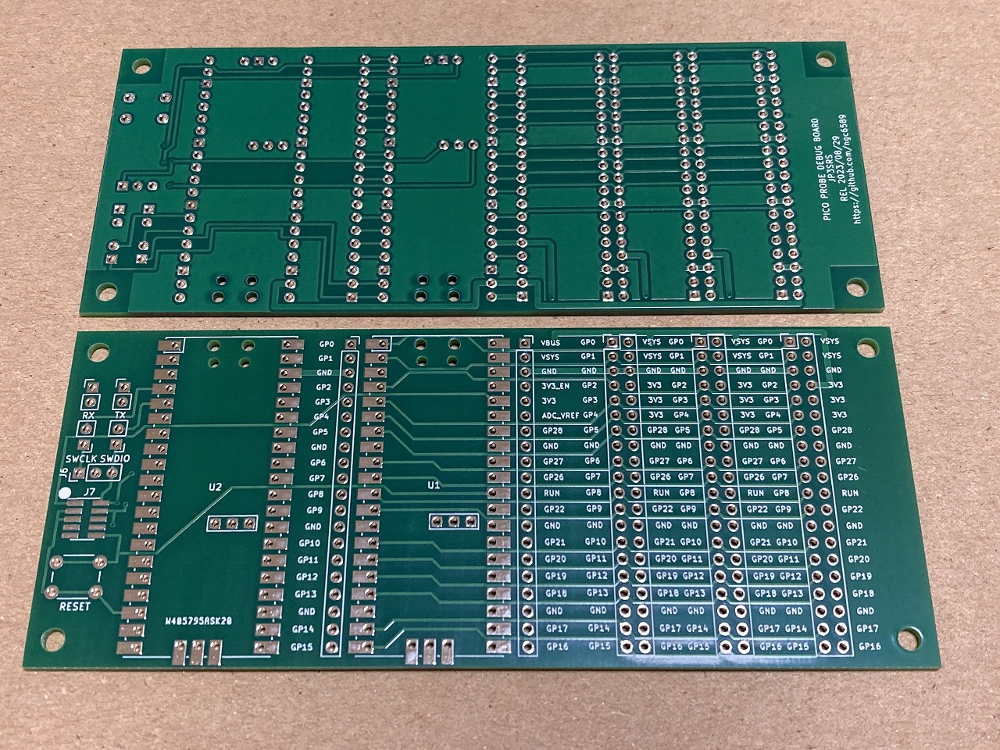

# Raspberry Pi Pico I/O Expansion Board

# この基板について

これは、Raspberry Pi Pico のピンを 2x20 のヘッダーピン（ピンソケット）に出す基板になります。ただし 2x20 ヘッダーピンは一部のピンを電源ピンに置き換えをしています。  
VBUS ピンは VSYS  
3V3_EN ピンは 3V3  
ADC_VREF は 3V3  

|Name|Pin|Pin|Name|
|---|---|---|---|
|GPIO0|1|40|VBUS → VSYS|
|GPIO1|2|39|VSYS|
|GND|3|38|GND|
|GPIO2|4|37|3V3_EN → 3V3|
|GPIO3|5|36|3V3|
|GPIO4|6|35|ADC_VREF → 3V3|
|GPIO5|7|34|GPIO28|
|GND|8|33|AGND|
|GPIO6|9|32|GPIO27|
|GPIO7|10|31|GPIO26|
|GPIO8|11|30|RUN|
|GPIO9|12|29|GPIO22|
|GND|13|28|GND|
|GPIO10|14|27|GPIO21|
|GPIO11|15|26|GPIO20|
|GPIO12|16|25|GPIO19|
|GPIO13|17|24|GPIO18|
|GND|18|23|GND|
|GPIO14|19|22|GPIO17|
|GPIO15|20|21|GPIO16|

# Pico Probe 接続
基板端の U2 は Pico Probe の Raspberry Pi Pico が実装される場所です。gdb でデバッグをする時は実装してください。  
Pico Probe は使用しないけど、刺したまま使用するときは基板の JP1 ～ JP4 のジャンパーピンを抜くことで分離できます。

# 電源
Pico Probe 用 Raspberry Pi Pico とターゲット(動作用)の Raspberry Pi Pico の VSYS 端子は接続されています。なので USB ケーブルをどちらに挿しても（同時挿し含む）Raspberry Pi Pico 並びに、2x20 ヘッダピン・ヘッダソケットの VSYS ピンには電源が供給されます。  
VSYS は USB コネクタの VBUS からショットキーバリアダイオード通過後の端子になるため 5V よりかは若干低い電圧であることは理解下さい。  
  
3V3 はターゲット Raspberry Pi Pico の 3V3 端子から供給されます。Raspberry Pi Pico の基板に 3.3V DC/DC コンバーターが搭載されていますが、Raspberry Pi Pico Datasheet の記載には、3V3 のピンは 300mA 以下推奨とあります。

# 部品表

|部品番号|部品名|数量|通販アドレス|備考|
|---|---|---|---|---|
|U1, U2, J4, J5|ピンソケット (メス) 1×20 (20P)|6|https://akizukidenshi.com/catalog/g/gC-03077/||
|U1, U2|ピンヘッダ 1×40 (40P)|2|https://akizukidenshi.com/catalog/g/gC-00167/|Pico にヘッダピン装着済みなら不要|
|U1|ピンヘッダ 1×3 (3P) (10個入)|1|https://akizukidenshi.com/catalog/g/gC-03949/|SWD端子用|
|U1|ピンソケット(メス) 1×3(3P)|1|https://akizukidenshi.com/catalog/g/gC-10098/|SWD端子用|
|J1, J2, J3|ピンヘッダ 2×20 (40P)|3|https://akizukidenshi.com/catalog/g/gC-00080/|
|JP1～JP4|ピンヘッダ 1×2 (2P) (10個入)|1|https://akizukidenshi.com/catalog/g/gC-08593/|
|JP1～JP4|ジャンパーピン赤(2.54mmピッチ) (25個入)|1|https://akizukidenshi.com/catalog/g/gP-03688/|
|SW1|タクトスイッチ（黄色）|1|https://akizukidenshi.com/catalog/g/gP-03650/|

# 回路図・ガーバーファイル
回路図は Schematic.pdf を参照してください。  
ガーバーファイルは 20221002.zip を参照してください。

# 引用
Raspberry Pi PICO の KiCad ライブラリは https://github.com/ncarandini/KiCad-RP-Pico を利用しています。

